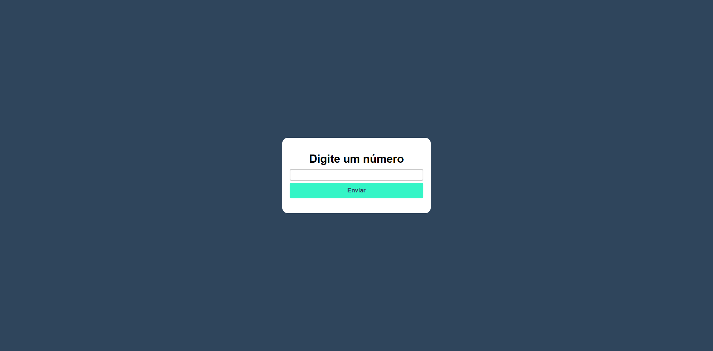
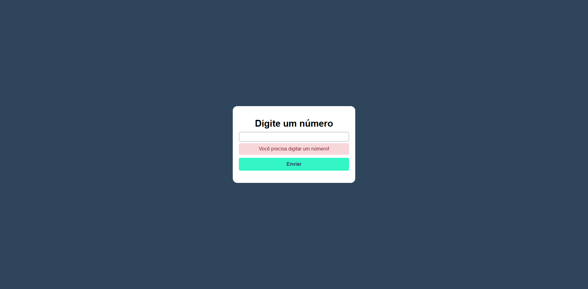

# PHP – Antecessor e Sucessor

Este projeto permite ao usuário digitar um número e visualizar **seu antecessor e sucessor**, sendo ideal para estudos de lógica, validação de formulários e PHP básico.

## 🔧 Requisitos

Para rodar este projeto, você precisa de um ambiente com suporte a PHP.  
Você pode usar:

- **XAMPP** (recomendado para iniciantes)
- WAMP / MAMP / Laragon
- Ou o servidor embutido do PHP:

git clone https://github.com/NicolasLimaDEV/PHP-Antecessor-e-Sucessor.git

php -S localhost:8000

http://localhost/PHP-Antecessor-e-Sucessor/index.php

## Screenshots do Projeto
Tela inicial

Tela de erro

Tela de Resultado Final

